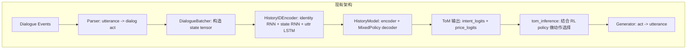
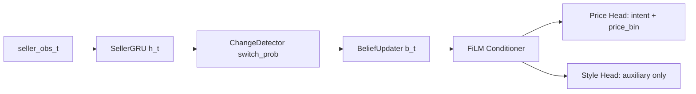

# Switch-Aware Explicit ToM v1 — 修改计划

## 用户反馈调整

1. **v1 loss 收缩**：先不开 L_style、L_next_*，只保留 L_price_intent + L_price_bin + L_switch + L_type
2. **style head 定位**：作为 auxiliary 输出，不参与 loss，不进 generator
3. **先核实数据语义**：已精确追踪 identity_state/state/extra 的实际内容（见第四节）
4. **返回接口改进**：外层兼容旧 tuple 接口，内层用 dict 传递丰富信息

---

## 一、现有架构概览



核心文件：
- `onmt/RLModels.py` — HistoryIDEncoder / HistoryIdentity / HistoryModel / MixedPolicy
- `neural/rl_model_builder.py` — 构建 actor / critic / tom 三个模型
- `neural/batcher_rl.py` — ToMBatch / RawBatch / RLBatch 数据封装
- `neural/generator.py` — LFSampler 运行时推理
- `neural/a2c_trainer.py` — ToM 训练循环
- `sessions/neural_session.py` — PytorchNeuralSession，tom_inference 逻辑
- `sessions/tom_session.py` — PytorchNeuralTomSession
- `options.py` — 命令行参数

## 二、新架构目标



保持 parser → manager → generator 总范式不变，仅替换 ToM manager 内部。
Style head 仅作为 auxiliary 输出，v1 不参与 loss，不进 generator。

## 三、文件修改清单

### 3.1 新建文件

| 文件路径 | 用途 |
|---------|------|
| `onmt/SwitchAwareToM.py` | 全部新模块：MLP / SellerObservationEncoder / SellerGRUEncoder / BinaryChangeDetector / ExplicitBeliefUpdater / BuyerPolicyCore / FiLMConditioner / BuyerPricePolicyHead / BuyerStylePolicyHead / SwitchAwareExplicitToM / BeliefState |
| `neural/tom_batcher.py` | ToMv2Batch：从现有 RawBatch 构造新模型所需输入 |
| `neural/tom_loss.py` | v1 多任务 loss：L_price_intent + L_price_bin + L_switch + L_type |

### 3.2 修改文件

| 文件 | 修改内容 |
|------|---------|
| `onmt/RLModels.py` | 末尾新增 SwitchAwareHistoryModel 包装类 |
| `neural/rl_model_builder.py` | make_rl_model() 新增 switch_aware 分支 |
| `options.py` | tom-model choices 新增 switch_aware + 专用超参 |
| `neural/a2c_trainer.py` | 新增 _tom_v2_gradient_accumulation 方法 |
| `sessions/neural_session.py` | 新增 seller_h / belief 状态维护（仅 training 时） |

### 3.3 按需修改 / 暂缓的文件

| 文件 | 说明 |
|------|------|
| `neural/generator.py` | v1 不改。ToM 输出仍是 (intent, price)，generator 接口不变 |
| `sessions/tom_session.py` | v1 不改。仅在 training 时用 neural_session，inference 时用旧逻辑 |

### 3.4 不修改的文件

model/parser.py、model/generator.py、model/manager.py、model/dialogue_state.py、neural/preprocess.py、neural/model_builder.py、core/ 目录 — 全部不动。

## 四、数据语义核实（已确认）

### RawBatch.convert_data() 产出的 state tuple

从 `batcher_rl.py` L200-206 追踪：

```python
state_sentence = torch.cat([encoder_intent, encoder_price], dim=-1)  # state_0
state_extra = encoder_extra                                           # state_1
state_obs = torch.cat([encoder_intent, encoder_price*encoder_pmask, encoder_pmask], dim=-1)  # state_2
```

#### state_0（state_sentence）
- 内容：`[intent_onehot, raw_price]`
- intent_onehot：`[B, state_length * intent_size]`，每步 intent 是 one-hot
- raw_price：`[B, state_length]`，每步的归一化 price 值
- 总 shape：`[B, state_length * (intent_size + 1)]`

#### state_1（state_extra）
- 来源：`batcher_rl.py` L928
  ```python
  extra = [r + [i/self.dia_num] + encoder_price[j][-2:] for j, r in enumerate(roles)]
  ```
- 内容 5 维：`[role_0, role_1, turn_ratio, last_price_buyer, last_price_seller]`
- role_0/role_1：one-hot 编码的角色（buyer=[1,0], seller=[0,1]）
- turn_ratio：`当前轮次 / 最大轮次`
- last_price_buyer/seller：双方最近一次报价的归一化值

#### state_2（state_obs）
- 内容：`[intent_onehot, masked_price, pmask]`
- shape：`[B, state_length * (intent_size + 2)]`
- masked_price = price * pmask（无报价时为 0）
- pmask：是否有报价的 0/1 标记

### ToMBatch.from_raw() 的提取逻辑

```python
# L624: 计算历史步数
length = state[2].shape[1] // (intent_size + 2)

# identity_state: 最近 2 步的 [intent_onehot*2, price*2, pmask*2]
intent = state[2][:, :length*intent_size][:, -intent_size*2:]        # [B, 2*intent_size]
price  = state[2][:, length*intent_size:length*(intent_size+1)][:, -2:]  # [B, 2]
pmask  = state[2][:, length*(intent_size+1):][:, -2:]                    # [B, 2]
identity_state = cat([intent, price, pmask])  # [B, 2*intent_size + 4]

# extra: 角色 + turn_ratio
extra = state[1][:, :3]      # [B, 3] = [role_0, role_1, turn_ratio]

# last_price: 双方最近报价
last_price = state[1][:, -2:]  # [B, 2] = [buyer_price, seller_price]

# state: 完整多步历史
state = state[2]              # [B, length*(intent_size+2)]
```

### 新模型的特征提取方案

基于上述语义，seller 特征从 identity_state 中提取：

```python
# seller 是 identity_state 中的第 2 步（index 1）
# 运行时断言：identity_state.shape[-1] == 2*intent_size + 4
assert identity_state.shape[-1] == 2*intent_size + 4, \
    f"identity_state shape mismatch: {identity_state.shape}"

seller_intent_onehot = identity_state[:, intent_size:2*intent_size]  # [B, intent_size]
seller_act_id = seller_intent_onehot.argmax(dim=-1)                  # [B]

seller_price_raw = identity_state[:, 2*intent_size + 1]              # [B] 第 2 步 price
seller_pmask = identity_state[:, 2*intent_size + 3]                  # [B] 第 2 步 pmask

# 量化到 100 bins，pmask==0 时 bin 设为 0（表示无报价）
seller_price_bin = torch.where(
    seller_pmask > 0.5,
    (seller_price_raw * 99).clamp(0, 99).long(),
    torch.zeros_like(seller_price_raw, dtype=torch.long)
)  # [B]

# buyer 是第 1 步（index 0）
buyer_intent_onehot = identity_state[:, :intent_size]
buyer_price_raw = identity_state[:, 2*intent_size]
buyer_pmask = identity_state[:, 2*intent_size + 2]
```

seller_num_feats 12 维构造：

| 维度 | 来源 | 说明 |
|------|------|------|
| 0 | seller_price_raw | seller 当前归一化 price |
| 1 | seller_price - prev_seller_price | delta_price（需跨步维护） |
| 2 | delta_price - prev_delta_price | delta2_price（需跨步维护） |
| 3 | buyer_price_raw | buyer 最近 price |
| 4 | seller_price - buyer_price | gap |
| 5 | extra[:, 2] | turn_ratio |
| 6 | seller_intent == offer_idx | is_offer |
| 7 | seller_intent == accept_idx | is_accept |
| 8 | seller_intent == reject_idx | is_reject |
| 9 | seller_intent == inquiry_idx | is_question |
| 10 | 0（v1 不可用） | has_side_offer placeholder |
| 11 | seller_pmask | seller_has_price（是否报价） |

## 五、返回接口设计（外层兼容、内层 dict）

```python
class SwitchAwareHistoryModel(nn.Module):
    """
    外层接口兼容 HistoryModel：
      forward(uttr, dia_act, state, extra, rnn_hiddens, id_gt)
      -> (predictions, next_hidden, identity)
    
    内层通过 self.last_aux_outputs dict 暴露丰富信息。
    """
    
    def forward(self, uttr, dia_act, state, extra, rnn_hiddens, id_gt=None):
        # 1. 从旧参数构造新模型输入
        step_batch = self._build_step_batch(dia_act, state, extra, uttr)
        
        # 2. 解包 hidden state
        if rnn_hiddens is None:
            h_prev, belief_prev = None, None
        elif isinstance(rnn_hiddens, tuple) and len(rnn_hiddens) == 2:
            h_prev, belief_prev = rnn_hiddens
        else:
            # 兼容旧格式：当作 h_prev，belief 初始化为 None
            h_prev = rnn_hiddens
            belief_prev = None
        
        # 3. 调用核心模块
        out_dict, h_next, belief_next = self.core.step(step_batch, h_prev, belief_prev)
        
        # 4. 外层兼容返回
        predictions = (out_dict['intent_logits'], out_dict['price_logits'])
        next_hidden = (h_next, belief_next)
        identity = out_dict['belief_type_probs']
        
        # 5. 内层 dict 挂到 self 上，供 trainer/session 按需读取
        self.last_aux_outputs = out_dict
        # out_dict 包含:
        # {
        #   'intent_logits':      [B, N_intents],
        #   'price_logits':       [B, N_price_bins],
        #   'style_logits':       [B, N_styles],       # auxiliary only
        #   'switch_logit':       [B, 1],
        #   'switch_prob':        [B, 1],
        #   'belief_type_probs':  [B, K_type],
        #   'belief_cont_mu':     [B, D_b_cont],
        #   'belief_cont_logvar': [B, D_b_cont],
        #   'belief_confidence':  [B, 1],
        #   'seller_hidden':      [B, D_h],
        # }
        
        return predictions, next_hidden, identity
```

## 六、Loss 设计（v1 简化版）

v1 只开启 4 项核心 loss：

```python
L_total = (
    L_price_intent                           # CE(intent_logits, gold_buyer_intent)
  + lambda_price * L_price_bin               # CE(price_logits, gold_buyer_price_bin)
  + lambda_switch * L_switch                 # BCE(switch_logit, pseudo_switch_label)
  + lambda_type * L_type                     # CE(belief_type_probs, gold_seller_type) [optional]
)
```

**L_type 设为 optional**：
- 默认 smoke test 时关闭（lambda_type=0）
- 需要 seller_type 标签时才开启
- 命令行参数：`--sa-lambda-type 0.5`（默认 0）

暂不开启（留待 v2）：
- L_style：style head 作为 auxiliary，不参与训练
- L_next_seller_act / L_next_seller_price：ToM 预测对手下一步

伪标签来源：
- `pseudo_switch_label`：seller price delta 突变（|delta| > 0.15）或 act type 跳变
- `gold_seller_type`：现有 7 类 strategy 映射到 4 类
  - insist → firm
  - decay / persuaded → cooperative
  - convex / concave / sigmoid / wait → volatile
  - low / high → competitive

## 七、实施步骤

### Phase 0: 基础设施
1. 新建 `onmt/SwitchAwareToM.py`，实现全部模块类
2. 新建 `neural/tom_batcher.py`，实现 ToMv2Batch
3. 修改 `options.py`，新增参数

### Phase 1: 模型构建
4. 修改 `onmt/RLModels.py`，新增 SwitchAwareHistoryModel
5. 修改 `neural/rl_model_builder.py`，新增 switch_aware 构建分支

### Phase 2: 训练（核心）
6. 新建 `neural/tom_loss.py`，实现 v1 四项 loss（L_type optional）
7. 修改 `neural/a2c_trainer.py`，新增 _tom_v2_gradient_accumulation
8. 修改 `sessions/neural_session.py`，新增 seller_h / belief 状态维护（仅 training）

### Phase 3: 脚本与验证
9. 新建训练脚本 `exp_scripts/identifier/train_switch_aware_tom.sh`
10. 冒烟测试：确保新模型能跑通一个 episode（lambda_type=0）
11. 验证旧模型路径不受影响

### Phase 4: 按需扩展（v1.5 或 v2）
12. 修改 `neural/generator.py`，支持 switch_aware 推理（如需 online inference）
13. 修改 `sessions/tom_session.py`，适配新模型（如需 self-play）

## 八、风险与注意事项

1. **seller_text_emb 维度**：现有 word_vec_size=64，v1 先用 64 维，后续可接 frozen LM
2. **style head**：v1 仅作为 auxiliary 输出，不参与 loss，不进 generator
3. **switch 伪标签**：用 price delta 突变（阈值 > 0.15）+ act type jump
4. **BeliefState 跨步传递**：在 session 中维护，batch size 变化时截断
5. **seller type 映射**：7 类 → 4 类，映射表见第六节（L_type 默认关闭）
6. **delta/delta2 特征**：需要跨步维护 prev_seller_price / prev_delta，初始值设为 0
7. **数据语义已核实**：identity_state / state / extra 的精确含义见第四节
8. **v1 范围限定**：仅改 training 路径，generator / tom_session 暂不改（按需扩展）
9. **seller 是第 2 步**：identity_state 包含最近 2 步，seller 是 index 1（运行时断言）
10. **price_bin 处理**：pmask==0 时 bin 设为 0，表示无报价
